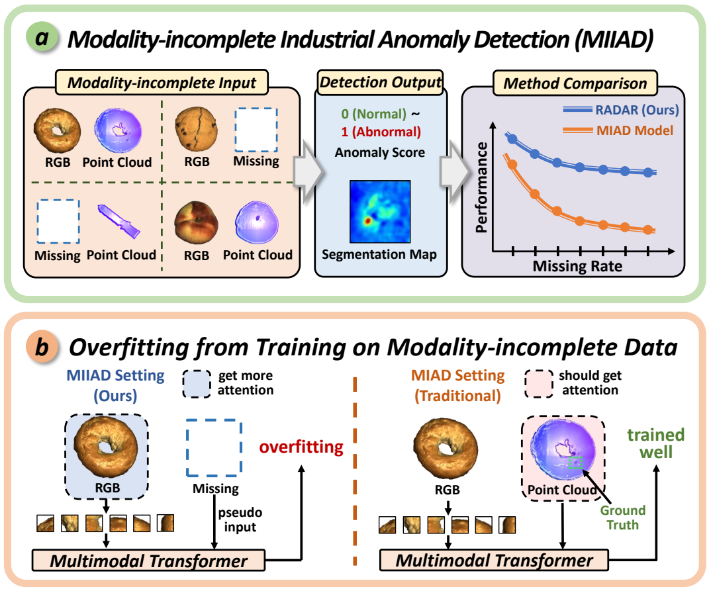

<h1 align="center" style="line-height: 40px;">
  RADAR: Robust Modality-Incomplete Anomaly Detection with Benchmark
</h1>


## 📖 Introduction

Welcome to the official repository for the paper "Robust Modality-incomplete Anomaly Detection: A Modality-instructive Framework with Benchmark". Modality incompleteness is unavoidable in real-world multimodal industrial anomaly detection. Thus, in this work, we propose a novel, challenging, and practical task - **Modality-Incomplete Industrial Anomaly Detection (MIIAD)** and its benchmark ***MIIAD Bench***. To address MIIAD challenges, we present RADAR, a **R**obust mod**A**lity-instructive fusing and **D**etecting fr**A**mewo**R**k. This project addresses the limitations of current MIAD paradigms that ignore real-world data imperfections. We are excited to open-source **RADAR** and ***MIIAD Bench***, providing the community with tools to advance robust industrial anomaly detection.

 


## 🔥 News
- **[Coming Soon]** We will release the paper, dataset, and code soon.


## 📝 TODO
- [ ] Release the paper "Robust Modality-incomplete Anomaly Detection: A Modality-instructive Framework with Benchmark".
- [ ] Release **MIIAD Bench** dataset splits and evaluation protocols.
- [ ] Release checkpoints of **RADAR**.
- [ ] Release training scripts and inference pipelines of **RADAR**.
- [ ] Release detailed documentation and tutorials.


## 💡 Overview
Industrial anomaly detection (IAD) relies on multimodal data (2D RGB images + 3D point clouds) to identify defects. However, real-world data collection often results in **missing modalities** (e.g., sensor failures or privacy constraints) while current research lacks investigation into this unavoidable modality-incomplete problem in IAD. To bridge the gap, we introduce a novel and challenging task - **Modality-Incomplete Industrial Anomaly Detection (MIIAD)** as well as a comprehensive benchmark ***MIIAD Bench***.

Through our experiments on ***MIIAD Bench***, we observe that current advanced MIAD methods exhibit significant performance degradation in MIIAD scenarios, demonstrating lack of robustness against varying modality-missing scenarios and suffering from overfitting issues when trained on modality-incomplete data. To overcome these challenges, we present **RADAR**, a **R**obust mod**A**lity-instructive fusing and **D**etecting fr**A**mewo**R**k.




### RADAR Framework
**RADAR** tackles modality incompleteness through two innovative stages:
1. **Adaptive Instruction Fusion**:  
   - Uses *modality-incomplete instructions* to guide multimodal Transformers.  
   - Leverages HyperNetworks for dynamic parameter adaptation.  
2. **Double-Pseudo Hybrid Detection**:  
   - Combines reconstruction and contrastive pseudo-supervision to mitigate overfitting.  
   - Integrates Mahalanobis Distance Matrix (MDM) and OCSVM for robust anomaly scoring.


### Contributions
+ **New Task & Benchmark**:  We first systematic study of **Modality-Incomplete Industrial Anomaly Detection (MIIAD)**.  And we construct ***MIIAD Bench*** with rich modality-missing configurations for real-world evaluation.  

+ **Robust Framework (RADAR)**:  **RADAR** use *Modality-incomplete instructions* for adaptive multimodal fusion and leverage *Double-Pseudo Hybrid Module* to prevent overfitting and improve generalization.  

+ **Superior Performance**: RADAR effectively improves existing advanced MIAD methods and outperforms other missing-modality based methods.


## 🛠️ Setups for *MIIAD Bench*

To cater to our research on modality-incomplete in IAD, we reconstructed the two prevailing datasets MVTec-3D AD and Eyecandies into a modality-incomplete setting, called ***MIIAD Bench***, guided by domain experts and incorporating insights from recent related works. We followed established modality-missing configurations and data processing protocols from recognized work to ensure methodological soundness.


## 🛠️ Setups for RADAR


## 📜 Citation
If you find our work useful, please cite our paper and star this repository:
```bibtex
